## Itemized Content

Often it is useful to include itemized content in a document.  This can take the form of bullet
points, numbered lists, and descriptions.  LaTeX can handle all of these forms of content.  Each
is called with a different command, and the lists will be styled and ranked according to the rules
of the `documentclass`.  All lists follow the same basic structure.  An environment is called with
the type of list, and each point is an `item` within the list.  Every time we want to "indent"
(think 1.. 2a.. 2b.. 3..) we need to create a new list environment within the confines of an
`item`.  The following list types will show how the same content can be represented in each type.

### Itemized Lists

Itemized lists are also called "bullet point" lists.  Each item is not ranked, but obeys hierarchy.
Itemized lists are called with `itemize`:

~~~
\documentclass{article}
\begin{document}
  \begin{itemize}
    \item The first item on our list
    \item The second item on our list
    \begin{itemize}
      \item The second item on our list, part 1
      \item The second item on our list, part 2
    \end{itemize}
    \item The third item on our list
  \end{itemize}
\end{document}
~~~
{: .language-tex}

Note that text that follows `item` does not need to be within curly braces.  All text following
an `item` is assumed to be part of that point when inside an `itemize` environment.

### Enumerated Lists

Numbered lists are similar to itemized lists, except they are, obviously, numbered.  Each item is
ranked in order that it appears and respects hierarchy.  Numbered lists are called with
`enumerate`:

~~~
\documentclass{article}
\begin{document}
  \begin{enumerate}
    \item The first item on our list
    \item The second item on our list
    \begin{enumerate}
      \item The second item on our list, part 1
      \item The second item on our list, part 2
    \end{enumerate}
    \item The third item on our list
  \end{enumerate}
\end{document}
~~~
{: .language-tex}

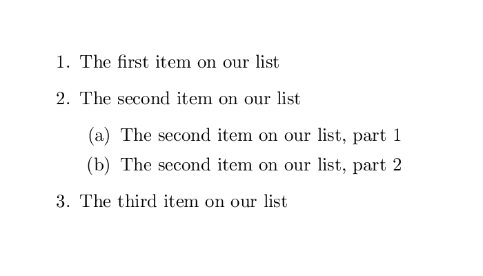

> If we desire, we can also nest different types of lists.  Hierarchy will be respected for all
> nested lists, even if the labeling scheme is not the same.
>
> ~~~
> \documentclass{article}
> \begin{document}
>   \begin{enumerate}
>     \item The first item on our list
>     \item The second item on our list
>     \begin{itemize}
>       \item The second item on our list, part 1
>       \item The second item on our list, part 2
>     \end{itemize}
>     \item The third item on our list
>   \end{enumerate}
> \end{document}
> ~~~
> {: .language-tex}
> 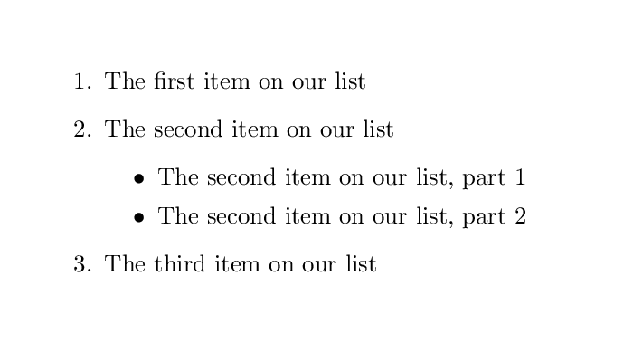
{: .callout}

### Descriptive Lists

Descriptive lists are a bit like definitions.  If we read a dictionary, we do not expect each word
to be numbered.  So `description` lists can appear without a bullet or numeral.  Descriptive lists
can, however, use an option box.  This will, depending on the style of the document declared in
`documentclass`, appear emboldened, with ample spacing, before the body of the `item` text.

~~~
\documentclass{article}
\begin{document}
  \begin{description}
    \item[Primary] The first item on our list
    \item[Secondary] The second item on our list
    \begin{description}
      \item[alt-Secondary-a] The second item on our list, part 1
      \item[alt-Secondary-a] The second item on our list, part 2
    \end{description}
    \item[Tertiary] The third item on our list
  \end{description}
\end{document}
~~~
{: .language-tex}

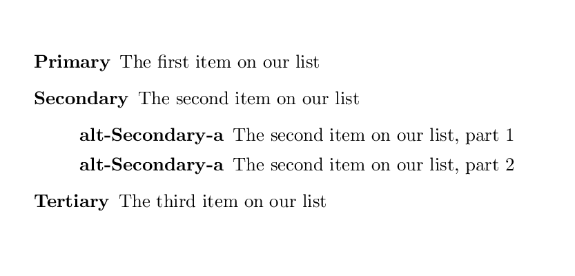

## Advanced Lists

There are lots of options when working with lists, and they can be customized in many ways.
Packages exist which can redefine the organization of a list, such that it appears horizontally,
spaces definitions based on the longest entry, use a custom image as a bullet point, and much
more.  Exploring these options will be left to the user as need arises.

<!-- NOTE remove this section? -->

## LaTeX Tables

Tables in LaTeX are declared using the `tabular` environment.  When declaring this environment,
you must know how many columns of data you will be presenting before you start.  The first
argument required when preparing a table is the alignment of each piece of data within the cell.
Then, data are listed in the environment with an ampersand `&` between each column.

~~~
\documentclass{article}
  \begin{document}
  \begin{tabular}{ c c c }
    A1 & B1 & C1
  \end{tabular}
\end{document}
~~~
{: .language-tex}

### Another Row? Another Line Break!

Rows are manually declared by starting a new line with `\\`.

~~~
\documentclass{article}
  \begin{document}
    \begin{tabular}{ c c c }
      A1 & B1 & C1 \\
      A2 & B2 & C2 \\
      A3 & B3 & C3
    \end{tabular}
\end{document}
~~~
{: .language-tex}

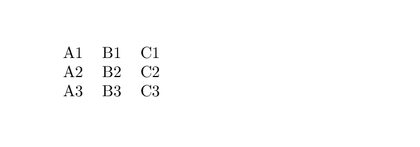

### Column Alignment

Columns in the `tabluar` environment are declared in the first argument, surrounded by curly
braces.  The alignment of the contents of each column is declared here.  A column can be told to
align toward the left margin (`l`), toward the right margin (`r`), or to align itself in the center
of the cell (`c`)

~~~
\documentclass{article}
  \begin{document}
  \begin{tabular}{ l r c }
    A1 & B1 & C1 \\
    A222 & B22 & C2 \\
    A3 & B333 & C33
  \end{tabular}
\end{document}
~~~
{: .language-tex}

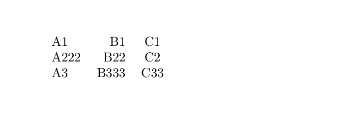

Table environments are types of floats.  They can be told where to position (`h`, `t`, `b`, `p`)
much in the same way as `figure` floats.  However, they should **NOT** use the `centering` command.
Telling a table to use `centering` will cause all content within the table to be centered.  This is
often undesirable.  Instead, to center a table, place the `tabular` environment within a `center`
environment.

~~~
\documentclass{article}
  \begin{document}
  \begin{center}
    \begin{tabular}{ l r c }
      A1 & B1 & C1 \\
      A222 & B22 & C2 \\
      A3 & B333 & C33
    \end{tabular}
  \end{center}
\end{document}
~~~
{: .language-tex}

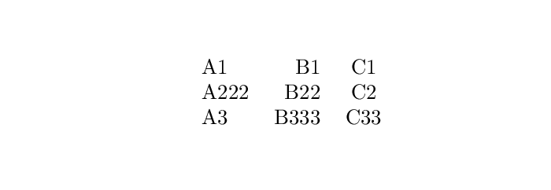

> It is a [best practice]({{ page.root }}/reference/#best practice) to organize your columns in
> your LaTeX file by the size of their content.  This will make it easier for you to read and make
> edits.  Most editors should use a monospace font, making this easy to implement.
{: .callout}

### Horizontal and Vertical Separators

A table with dividing lines can be generated by declaring horizontal bars (`|`) in the column
alignment description.  Bars placed between the alignment characters will become vertical lines
throughout the table.

~~~
\documentclass{article}
  \begin{document}
  \begin{center}
    \begin{tabular}{ l | r | c }
      A1 & B1 & C1 \\
      A222 & B22 & C2 \\
      A3 & B333 & C33
    \end{tabular}
  \end{center}
\end{document}
~~~
{: .language-tex}

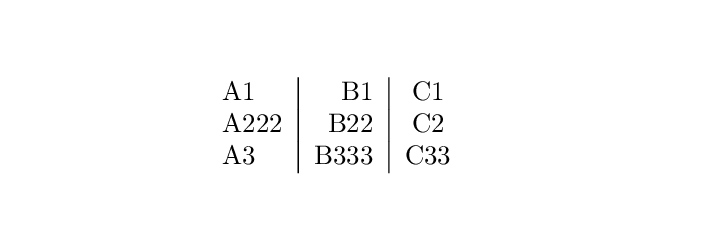

Horizontal lines are generated using the `hline` command.  These are generally added next to the
newline commands `\\` for rows in the table.

~~~
\documentclass{article}
  \begin{document}
  \begin{center}
    \begin{tabular}{ l | r | c }
      A1 & B1 & C1 \\ \hline
      A222 & B22 & C2 \\ \hline
      A3 & B333 & C33
    \end{tabular}
  \end{center}
\end{document}
~~~
{: .language-tex}

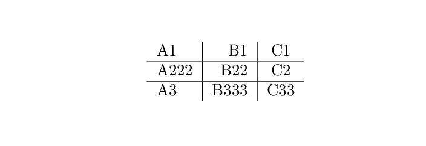

### Stretching or Merging Cells

To combine the contents of cells, a special cell is declared using either `multicolumn` or
`multirow`, depending on the context.  These commands are defined in the `multirow` package.  The
`multicolumn` command requires one set of curly braces declaring the number of columns or rows to
stretch, a second set of curly braces which describes the alignment and bars to use with the cell,
and a third set of curly braces for the contents.

The `multirow` command uses a similar structure, save the contents of the second set of braces.
In the `multirow` second set of braces, the width of the new row is defined.  It is recommended to
simply place `*` in this spot, which allows the `multirow` to stretch dynamically based on the
other rows.  A `multirow` cell will require a column, so don't forget to leave room for it.

~~~
\documentclass{article}
\usepackage{multirow}
  \begin{document}
  \begin{center}
    \begin{tabular}{ c || l | r | c }
      \multicolumn{4}{|c|}{Columns} \\ \hline \hline
      \multirow{3}{*}{Rows}
      & A1 & B1 & C1 \\ \hline
      & A222 & B22 & C2 \\ \hline
      & A3 & B333 & C33
    \end{tabular}
  \end{center}
\end{document}
~~~
{: .language-tex}

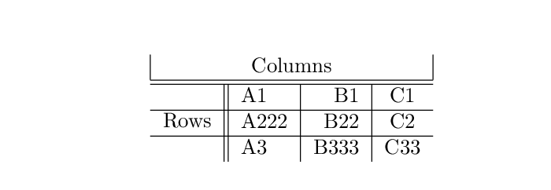

Controlling `hline` can become challenging when using a `multirow`.  In the example above, the
overzealous lines look ugly when they cut across the combined cell.  To cope with this, we change
our `hline` commands to `cline`.  The `cline` is exactly the same, but with the ability to specify
the rows for the line to be visible on.  With some careful arrangement, we can make our simple
table look professional.

~~~
\documentclass{article}
\usepackage{multirow}
  \begin{document}
  \begin{center}
    \begin{tabular}{ c || l | r | c }
      & \multicolumn{3}{c}{Columns} \\ \hline \hline
      \multirow{3}{*}{Rows}
      & A1 & B1 & C1 \\ \cline{2-4}
      & A222 & B22 & C2 \\ \cline{2-4}
      & A3 & B333 & C33
    \end{tabular}
  \end{center}
\end{document}
~~~
{: .language-tex}

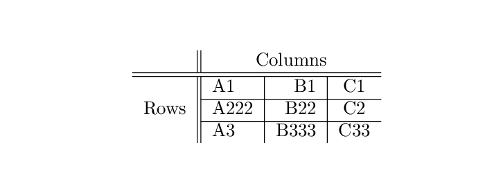

### Text Wrapping and Cell Size

Sometimes, a large amount of text will be entered into a cell.  However, LaTeX does not
automatically wrap text within a cell.  The size of the cell is fit to the contents, so a very
long sentance in a cell can make the size strange, or even extend it beyond the page.  A special
alignment can be used in this case, `p`. Compare these two examples:

~~~
\documentclass{article}
\usepackage{multirow}
  \begin{document}
  \begin{center}
    \begin{tabular}{ c || l | r | c }
      & \multicolumn{3}{c}{Columns} \\ \hline \hline
      \multirow{3}{*}{Rows}
      & A1 & B1 & This is column C with row number one \\ \cline{2-4}
      & A222 & B22 & This is column C with row number two \\ \cline{2-4}
      & A3 & B333 & This is column C with row number three
    \end{tabular}
  \end{center}
    ~
  \begin{center}
    \begin{tabular}{ c || l | r | p{3.3cm} }
      & \multicolumn{3}{c}{Columns} \\ \hline \hline
      \multirow{3}{*}{Rows}
      & A1 & B1 & This is column C with row number one \\ \cline{2-4}
      & A222 & B22 & This is column C with row number two \\ \cline{2-4}
      & A3 & B333 & This is column C with row number three
    \end{tabular}
  \end{center}
\end{document}
~~~
{: .language-tex}

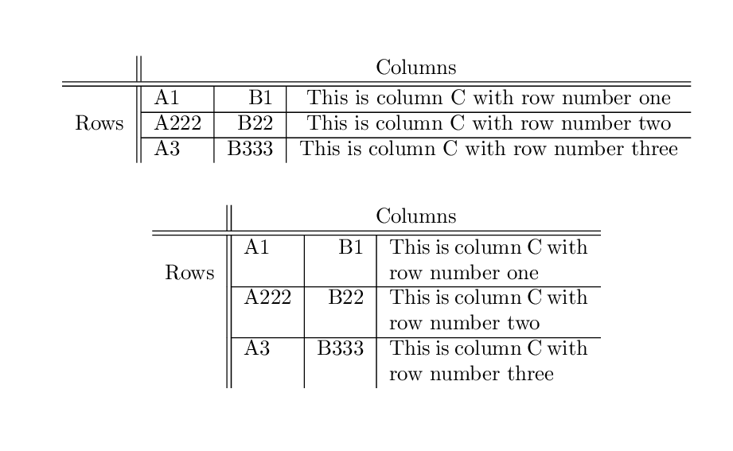

## Float the Table

Since the LaTeX `tabular` environment is a float, we can apply options to it in much the same way
as figures.  As we have seen, the location on the page can be controlled with `h`, `t`, `b`, `p`.
We can also take advantage of the float rules to scale contents.  Floats can be thought of as
miniature pages within our page.  If we place this into a new environment that changes the size
of the `tabular` environment to meet our needs.  In this way, very large tables can fit on
relatively smaller sized pages.

The `resizebox` and `scalebox` commands provided by the `graphicx` package can be used to change
the size of a float.  The `resizebox` command takes the form of width, height, and contents in
separate sets of curly braces (the character `!` is used as a wildcard).  Likewise, the `scalebox`
command requires a ratio and the contents in two separate sets of curly braces.

~~~
\documentclass{article}
\usepackage{multirow}
\usepackage{graphicx}
  \begin{document}
    \begin{center}
      \resizebox{10cm}{!}{
        \begin{tabular}{ c || l | r | c }
          & \multicolumn{3}{c}{Columns} \\ \hline \hline
          \multirow{3}{*}{Rows}
          & A1 & B1 & C1 \\ \cline{2-4}
          & A222 & B22 & C2 \\ \cline{2-4}
          & A3 & B333 & C33
        \end{tabular}
      }
    \end{center}
    ~
    \begin{center}
      \scalebox{2}{
        \begin{tabular}{ c || l | r | c }
          & \multicolumn{3}{c}{Columns} \\ \hline \hline
          \multirow{3}{*}{Rows}
          & A1 & B1 & C1 \\ \cline{2-4}
          & A222 & B22 & C2 \\ \cline{2-4}
          & A3 & B333 & C33
        \end{tabular}
      }
    \end{center}
\end{document}
~~~
{: .language-tex}

As long as we are treating the table as a float, it is worth noting that other properties present
in the `figure` environment can be applied to the `table` environment such as captions.  Note that
this requires the `table` environment **in addition** to the `tabular` environment.

~~~
\documentclass{article}
\usepackage{multirow}
  \begin{document}
  \begin{table}[t]
    \begin{center}
      \begin{tabular}{ c || l | r | c }
        & \multicolumn{3}{c}{Columns} \\ \hline \hline
        \multirow{3}{*}{Rows}
        & A1 & B1 & C1 \\ \cline{2-4}
        & A222 & B22 & C2 \\ \cline{2-4}
        & A3 & B333 & C33
      \end{tabular}
    \end{center}
    \caption{A table of values}
  \end{table}
\end{document}
~~~
{: .language-tex}

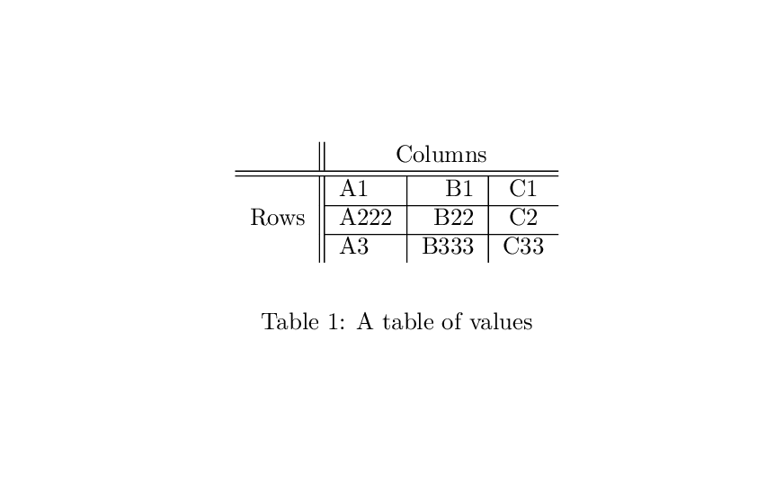


