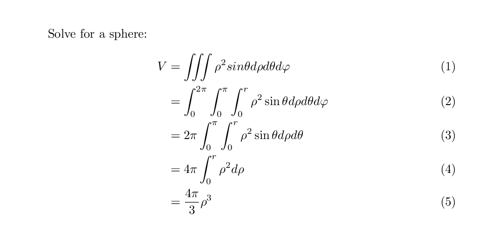
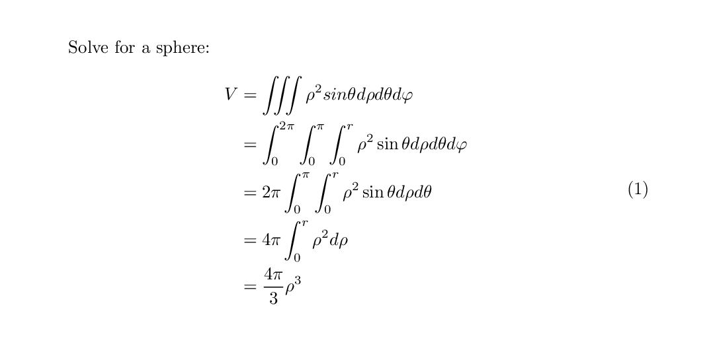
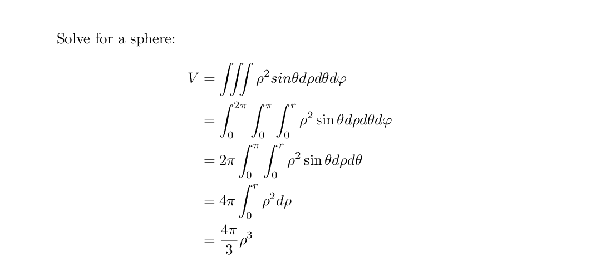

One of the most powerful parts of LaTeX is its ability to properly typeset mathematical
equations.  The groundwork TeX laid for typesetting equations is so important, that nearly every
writing tool that even attempts to make math look "correct" uses TeX at its core.

## Math Mode

Math mode is an environment which can be called in LaTeX.  It changes the typesetting from a focus
on readable text to treating characters entered as mathematical variables and operators.  The logic
is very simple, and can be used to create very complex notation.

***Math mode ignores spaces.***

The math mode environment can be called in several ways.  The first, and most obvious, is by
creating an `equation` environment.

~~~
\documentclass{article}
\begin{document}
  What is y?
  \begin{equation}
      y = 3x+21
  \end{equation}
\end{document}
~~~
{: .language-tex}

The `equation` environment not only enters math mode, but also prints the equation number in the
righthand margin, as is required in many mathematical contexts.  If you do not want an equation
number printed in the margin, the number will be ignored if we issue a "do not count" version of
it using `equation*`.  This command is provided by the `amsmath` package.

~~~
\documentclass{article}
\begin{document}
  What is y?
  \begin{equation*}
      y = 3x+21
  \end{equation*}
\end{document}
~~~
{: .language-tex}

One synonym for the `equation*` environment is the square bracket environment.  This has the exact
same properties as `equation*`, but is called with a shorter command that does not require the
`amsmath` package.

~~~
\documentclass{article}
\begin{document}
  What is y?
  \[
      y = 3x+21
  \]
\end{document}
~~~
{: .language-tex}

### Inline Math

Often it is important to include some equation or even a single symbol within the body of text
of a document.  It is possible to enter into math mode using `$` (without escape characters).
While this will enter math mode, it will not increase an equation counter.

~~~
\documentclass{article}
\begin{document}
  What is $y$?
  \begin{equation}
      y = 3x+21
  \end{equation}
\end{document}
~~~
{: .language-tex}

## Super- and Sub- scripting

To begin entering notation within a superscript (e.g. a power function) or a subscript (e.g. the
nth value in a series), the caret (`^`) or underscore (`_`) character is used, respecitvely.  Any
notation placed in curly braces at these commands will be shifted into this script level.

~~~
\documentclass{article}
\begin{document}
  What is $y_{n}$?
  \begin{equation}
      y_{n} = 3x^{2}+21
  \end{equation}
\end{document}
~~~
{: .language-tex}

> If no curly braces are used, the first character to follow the script symbol is promoted/demoted.
> This means that `$x^2$` is a valid function, but `$x^20$` would not equal `$x^{20}$`.  It is wise
> to get in the habit of using curly braces all the time, to prevent confusion.
{: .callout}

This scripting works with symbols too.

~~~
\documentclass{article}
\begin{document}
  What is the volume of a solid ($V$) with a non-uniform cross-sectional area ($A$)?
  \begin{equation}
      V = \int_{n_{1}}^{n_{2}}A(x)dx
  \end{equation}
\end{document}
~~~
{: .language-tex}

## Stacking Fractions and Division

Plain text makes division notation look nothing like we might see in a good math textbook.  This
is also true when we enter math mode.  The backslash `/` as a divisor just looks silly.  Our math
looks much better when stacked appropriately above and below a horizontal line.  For this, we use
the command `frac`, where the numerator and denominator go in sequential curly braces.

~~~
\documentclass{article}
\begin{document}
  What is slope ($m$)?
  \begin{equation}
      m = (y_{2}-y_{1})/(x_{2}-x_{1})
  \end{equation}
  ~
  \begin{equation}
      m = \frac{y_{2}-y_{1}}{x_{1}-x_{2}}
  \end{equation}
\end{document}
~~~
{: .language-tex}

## Dynamic Delimiters

While it may seem easy to use simple delimiters, such as parentheses in math mode, they do not
operate the way one might expect.  When a parenthesis is entered as notation, the size will be
static and unchanging.  However, the height of an equation when displayed in math mode is stretchy.
It is recommended to use special delimiters such as `left(` and `right)` instead, as these will
automatically adapt to the size of the rest of the notation within the environment.

~~~
\documentclass{article}
\begin{document}
  What is the attractive force of two bodies ($F$)?
  \begin{equation}
      F = G(\frac{m_{1}m_{2}}{r^{2}})
  \end{equation}
  ~
  \begin{equation}
      F = G\left(\frac{m_{1}m_{2}}{r^{2}}\right)
  \end{equation}
\end{document}
~~~
{: .language-tex}

> Even more delimiters are provided by the `amsmath` package, such as big ones (`bigl(`) and
> some even bigger ones (`Bigl(`)
{: .callout}

## What If I Need a Weird Symbol?

LaTeX is ready to accomodate your needs with many symbols.  The default package comes with a large
number of symbols which can be placed in math mode.  They are all straightforward commands.  No
more will you have to hunt for ALT codes or copy and paste from the Unicode tables.  The tables
below list the symbols available to the default installation.

> If you ever have a problem with a command sequence symbol not behaving next to a text symbol,
> such as `\neqx` not showing up properly, you can add a single set of curly braces to tell the
> LaTeX math parser not to confuse the separate entities (`\neq{}x`).
{: .callout}

<!-- NOTE put symbols on special page that links here -->

## Breaking a Long Equation Across Multiple Lines

There are lots of ways to do this using the `amsmath` package, and we cannot cover them all here.
Instead, we will focus on a few here.

### Align Based on Centering Mark

Equations can be aligned across several lines which centers on a particular feature of an equation.
The most common part of an equation to center is an equality.  This is especially useful for
multi-lined derivations.  This can be performed with the `align` environment.  Within this
environment, equations will center wherever the user places an ampersand (`&`).  Only one ampersand
can be used for each line, and each line must be broken by a newline character (`\\`).

~~~
\documentclass{article}
\usepackage{amsmath}
\begin{document}
  Solve for a sphere:
  \begin{align}
    V &= \iiint \rho^{2} sin{\theta} d\rho d\theta d\varphi \\
    &= \int_{0}^{2\pi} \int_{0}^{\pi} \int_{0}^{r} \rho^{2} \sin{\theta} d\rho d\theta d\varphi \\
    &= 2\pi \int_{0}^{\pi} \int_{0}^{r} \rho^{2} \sin{\theta} d\rho d\theta \\
    &= 4\pi \int_{0}^{r} \rho^{2} d\rho \\
    &= \frac{4\pi}{3}\rho^{3}
  \end{align}
\end{document}
~~~
{: .language-tex}

Note that each step in this equation is given an equation number counter.  If we want everything in
this equation block to have a single equation counter, we need to `split` a single `align`
environment.

~~~
\documentclass{article}
\usepackage{amsmath}
\begin{document}
  Solve for a sphere:
  \begin{align}
    \begin{split}
      V &= \iiint \rho^{2} sin{\theta} d\rho d\theta d\varphi \\
      &= \int_{0}^{2\pi} \int_{0}^{\pi} \int_{0}^{r} \rho^{2} \sin{\theta} d\rho d\theta d\varphi \\
      &= 2\pi \int_{0}^{\pi} \int_{0}^{r} \rho^{2} \sin{\theta} d\rho d\theta \\
      &= 4\pi \int_{0}^{r} \rho^{2} d\rho \\
      &= \frac{4\pi}{3}\rho^{3}
    \end{split}
  \end{align}
\end{document}
~~~
{: .language-tex}

The `split` is only a valid sub-environment for `align`.  It can only be used within another float,
not on its own.

As with most "counted" environments, `align` can be converted to `align*` to prevent adding a
counter on the side of the page.

~~~
\documentclass{article}
\usepackage{amsmath}
\begin{document}
  Solve for a sphere:
  \begin{align*}
    \begin{split}
      V &= \iiint \rho^{2} sin{\theta} d\rho d\theta d\varphi \\
      &= \int_{0}^{2\pi} \int_{0}^{\pi} \int_{0}^{r} \rho^{2} \sin{\theta} d\rho d\theta d\varphi \\
      &= 2\pi \int_{0}^{\pi} \int_{0}^{r} \rho^{2} \sin{\theta} d\rho d\theta \\
      &= 4\pi \int_{0}^{r} \rho^{2} d\rho \\
      &= \frac{4\pi}{3}\rho^{3}
    \end{split}
  \end{align*}
\end{document}
~~~
{: .language-tex}

## Adding Text Comments to Rendered Math

Sometimes, it is useful to add text to an equation without leaving the math environment.  Text used
in this case needs to distinctly be printed in the format as text from the body of a document, and
not use math notation.  To add text within an equation, use the `text` command within the math
environment.  This requires the `amsmath`package.

~~~
\documentclass{article}
\usepackage{amsmath}
\begin{document}
  What is the attractive force of two bodies ($F$)?
  \begin{equation}
      F = G\left(\frac{m_{1}m_{2}}{r^{2}}\right) \text{ Where } m_1 \text{ and } m_2
      \text{ are the mass of each body.}
  \end{equation}
\end{document}
~~~
{: .language-tex}


